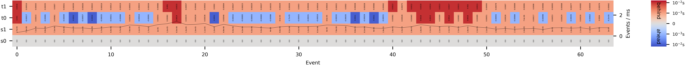

# Metered Pipe

This interprocess pipe records the timestamps
when

s0) `send` is called ("event"),

s1) `send` succeeds,

t0) `recv` is called, and

t1) `recv` succeeds.

Thus, it can be used to diagnose communication bottlenecks.

The pipe buffers and packages multiple
send calls into one system send call
(controlled by `SYSTEM_SEND_MAX_FREQUENCY`)
to increase throughput.

The included visualization routine
produces the following summary plot
where 
for each event the delay from s0 is shown
as a heatmap
and
the graph is a running estimate of 
events / ms.

**NB**: The writing end may require a call to **flush()** when done.

